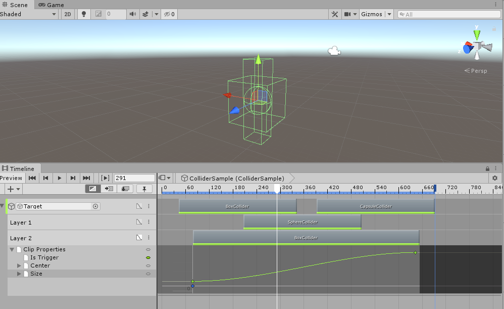
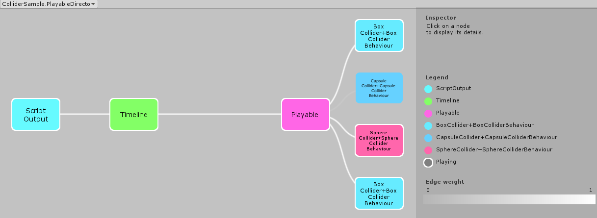
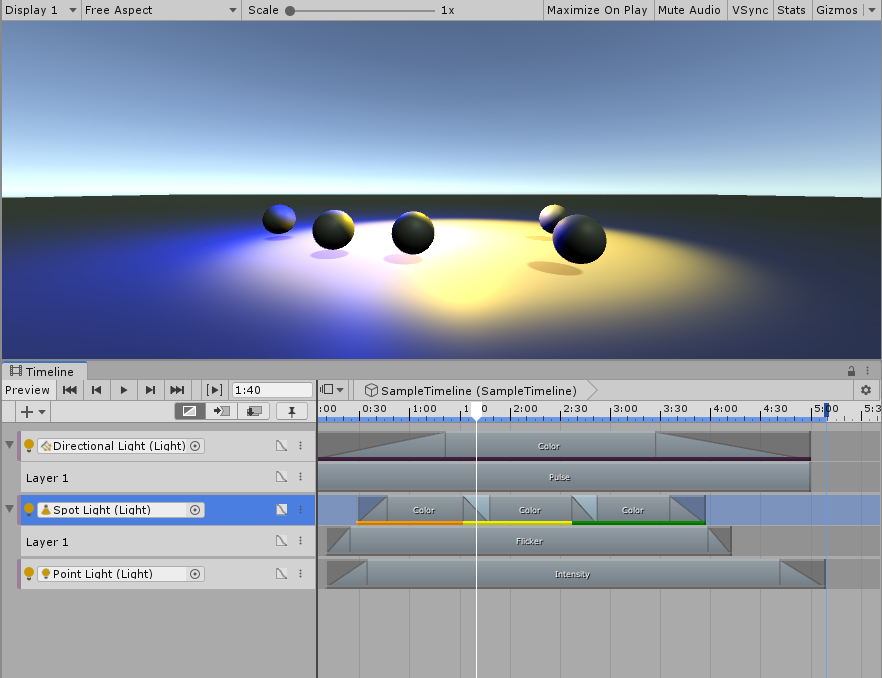
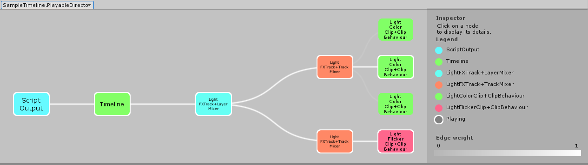
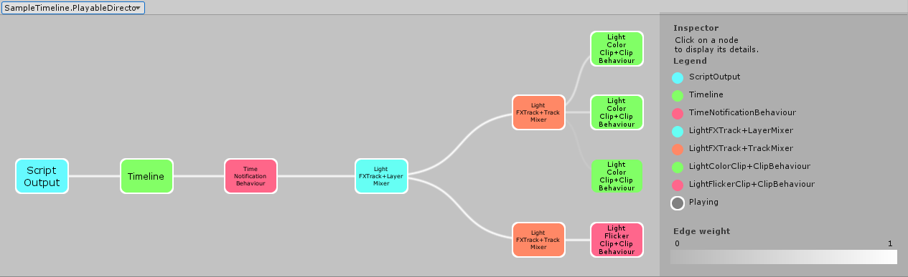

**Note:** this was code was supplied in a Unity Forum post [code-samples-for-how-to-use-ilayerable](https://forum.unity.com/threads/any-code-samples-for-how-to-use-ilayerable.745751/#post-4969409)

# Layered Tracks

Starting in version 2019.3, multiple layers on a track are available to custom tracks. Previously, this functionality existed solely on AnimationTracks as _override_ tracks.

Using layers allows for tracks to overlap clips without blending by placing them on separate _layers_. This can be useful when multiple types of clips can be present on a track. Similar to override tracks, this can also be useful when clips can override, or add to, the behaviour of other clips.

It also allows users to author timelines where the intent is to have several tracks of the same type bound to the same target object.

## Authoring MultiLayered Tracks

To indicate that a custom track supports layers, implement the _UnityEngine.Timeline.ILayerable_ interface on your custom track.

## Layered Track Storage and API

Layered Tracks are stored using a single level parent/child hierarchy. The top most track is considered the parent of all the other layers. To create a subtrack from script, pass the base track in to the parent parameter of _TrackAsset.CreateTrack()_. An exception will be thrown if the types are not the same, or the parent track is not the base layer. Retrieving all the layers from a track can be accomplished using _TrackAsset.GetChildTracks()_.

```csharp
   var baseTrack = timelineAsset.CreateTrack<MyLayeredTrack>("Base Track");
   var layer1 = timelineAsset.CreateTrack<MyLayeredTrack>(baseTrack, "Layer 1");
   var layer2 = timelineAsset.CreateTrack<MyLayeredTrack>(baseTrack, "Layer 2");

   foreach (var layer in baseTrack.GetChildTracks())
      Debug.Log(layer.name);
```

### Clip Based Tracks

How layered tracks should be authored depends on the how the track and their clips process and write their data. In some cases, the PlayableBehaviour for the clip operates completely independently of other clips on the track. Inside Timeline, an example of this type of clip would be the clips on a ControlTrack.

In the provided samples, the ColliderTrack is a track where each clip adds, maintains, and removes a collider component on the bound gameObject. The clip is responsible for adding the collider component when the clip becomes active, removing the component when it becomes inactive and applying any animated parameters while the clip is active. For example, this track could be used to create dynamic composited trigger volumes in a game level.

Each clip on the ColliderTrack operates independently, and having multiple clips active at a single frame is a valid operation. Thus no mixing of clips is supported or required.



To implement the ILayerable interface, the _CreateLayerMixer_ method is required. Because the ColliderTrack does not require any mixing, it does not override the CreateTrackMixer method from _TrackAsset_ and it implements _CreateLayerMixer_ by simply returning _Playable.Null_.

```csharp
   Playable ILayerable.CreateLayerMixer(PlayableGraph graph, GameObject go, int inputCount)
   {
      return Playable.Null;
   }
```

Because _CreateTrackMixer_ is not overriden, Timeline will use a single generic Playable to attach all the playables generated from clips. And _CreateLayerMixer_ returning Playable.Null will indicate to Timeline that all clips can be effectively collapsed down to the base layer during compilation of the playable graph.

Using the PlayableGraph Visualizer, we can see exactly this structure in the generated graph.



### Tracks with Custom Mixers

If a track uses a PlayableBehaviour as a mixer, then the mixer may need modifications to support layers.

With a single track, the Timeline Editor tries to enforce that only one clip is active at a single time, or, if blending is supported, that the weights on the clips are always normalized.

When using layers, this may no longer be the case. This may not matter to some mixing algorithms, but may not work for others.

As a trivial example, a mixer for an ActivationTrack could be implemented by determining if there are any clips active for the current time.

```csharp
public override void ProcessFrame(Playable playable, FrameData info, object playerData)
{
   int inputCount = playable.GetInputCount();
   bool hasInput = false;
   for (int i = 0; i < inputCount && !hasInput; i++)
   {
      hasInput |= m_Playable.GetPlayState() == PlayState.Playing;
   }

   ((GameObject)playerData).SetActive(hasInput);
}
```

The ActivationTrack is providing this custom mixer using an overridden  _CreateTrackMixer_ method from _TrackAsset_. As in the previous example collapsing all playables generated from clips down to the first layer would be sufficient to support layers. So, if this ActivationTrack needed to support layers, it could do the same as the ColliderTrack and implement the _ILayerable_ interface, and have its _CreateLayerMixer_ method return Playable.Null.

However, most track mixers are more complicated, and either assume normalized data, or normalize the data itself. Either of these scenarios will probably not produce the correct results with layered tracks.

### Implementing Layer Mixers

In the samples provided, there is a LightFXTrack. This is a track where the clips will modify the color and/or intensity of a light to produce different lighting effects.

Similar to animation tracks, subsequent layers can override the value generated from a previous layer. Additionally, each layer contains an option to make their clips _additive_ to the previous layer. In this example, the effects of the clips will mix differently depending both on which layer they reside on and the options on that layer.



The algorithm for the light FX tracks is as follows.

* Each clip generates a PlayableBehavior that generates a color and/or intensity.
* Each track (i.e. layer) uses PlayableBehaviour mixer that gathers a computed color and intensity from the clip PlayableBehaviours, and a corresponding weight from each.
* The Layer Mixer uses a default value and the output from each track mixer to produce a final color and intensity, and writes this to the target Light object.

To demonstrate this, we can example one of the clip PlayableBehaviour ProcessFrame methods. In this example, the light is 'pulsed' by applying a cosine curve to the time to produce an intensity for the light.

``` csharp
   public override void ProcessFrame(Playable playable, FrameData info, object playerData)
   {
      float min = Mathf.Min(Range.x, Range.y);
      float offset = Mathf.Abs(Range.y - Range.x);

      Intensity = Mathf.Cos((float) (playable.GetTime()/Period * 2 * Math.PI)) * 0.5f + 0.5f;
      Intensity = min + Intensity * offset;
   }
```

Next, for each track, the intensity and color values are mixed by a track PlayableBehaviour. Unlike a regular track mixer, the values are not written to the bound object, which is accessable through the playerData parameter. For brevity, the code below demonstrates the mixing of the intensity only, but the same algorithm is applied to color in the sample.

``` csharp
   public override void ProcessFrame(Playable playable, FrameData info, object playerData)
   {
      IntensityWeight = 0;
      Intensity = 0;

      int inputCount = playable.GetInputCount();
      for (int i = 0; i < inputCount; i++)
      {
         var weight = playable.GetInputWeight(i);
         if (weight <= float.Epsilon)
            continue;

         var input = playable.GetInput(i);
         if (input.GetPlayState() != PlayState.Playing)
            continue;

         var type = input.GetPlayableType();
         if (!typeof(LightFXBehaviourBase).IsAssignableFrom(type))
            continue;

         var scriptPlayable = (ScriptPlayable<LightFXBehaviourBase>) input;
         var behaviour = scriptPlayable.GetBehaviour();
         var intensityModifier = behaviour as IIntensityModifier;
         if (intensityModifier != null)
         {
            IntensityWeight += weight;
            Intensity += intensityModifier.Intensity * weight;
         }
      }
   }
```

Finally, the layer mixer takes all the value from the track mixers, combines them and writes them to the target object.

```csharp
   public override void ProcessFrame(Playable playable, FrameData info, object playerData)
   {
      var intensity = defaultIntensity;
      int inputCount = playable.GetInputCount();
      for (int i = 0; i < inputCount; i++)
      {
         var input = playable.GetInput(i);
         var trackMixer = ((ScriptPlayable<TrackMixer>) input).GetBehaviour();
         if (trackMixer.IntensityWeight <= 0)
            continue;

         if (trackMixer.Additive)
            intensity += trackMixer.Intensity * trackMixer.IntensityWeight;
         else
            intensity = Mathf.Lerp(intensity, trackMixer.Intensity, trackMixer.IntensityWeight);
      }

      var light = playerData as Light;
      if (light != null)
         light.intensity = intensity;
   }
```

This can be visualized using the PlayableGraphVisualizer.



### Tracks With Animated Fields

For tracks that support both animated fields and layers, a valid LayerMixer playable is required, since a track mixer is required for each track that contains animation. Timeline will generate a warning if no layer mixer is provided and layers with animated fields exist, and the animated fields will be discarded.

### Notifications

When markers that support notifications, such as Signals are added to either the base track or one of its layers a single additional playable is added between the layer mixer and the timeline playable that contains all notifications from all layers.

